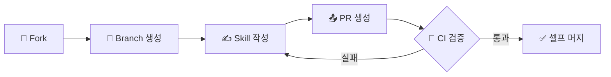

<div align="center">

# L3G4CY Bug Bounty Skills

**LLM 에이전트(Claude Code) 기반 버그바운티 Skills 공유 저장소**

팀원 간 방법론과 지식을 공유하여 토큰 효율과 취약점 식별 능력을 높입니다.

[](./LICENSE)
[](https://github.com/L3G4CY-TEAM/L3G4CY-BugBounty-Skiils/actions/workflows/validate-skill.yml)
[](./CONTRIBUTING.md)
[](https://github.com/L3G4CY-TEAM/L3G4CY-BugBounty-Skiils/graphs/contributors)

</div>

---

## 목차

- [핵심 특징](#-핵심-특징)
- [저장소 구조](#-저장소-구조)
- [Skill 카탈로그](#-skill-카탈로그)
- [퀵 스타트](#-퀵-스타트)
- [제약 조건](#-제약-조건)
- [기여 흐름](#-기여-흐름)
- [보안 정책](#-보안-정책)
- [면책 조항](#-면책-조항)
- [라이선스](#-라이선스)

---

## 🎯 핵심 특징

| | 특징 | 설명 |
|:---:|------|------|
| 🤖 | **Claude Code 네이티브** | Agent Skills 스펙 기반 — Claude Code가 바로 인식하고 활용 |
| 📐 | **토큰 효율 설계** | 500줄/5,000토큰 제한으로 context window 낭비 방지 |
| 🔒 | **자동 보안 검증** | PR마다 gitleaks 시크릿 스캔 + 금지 파일 차단 + 소유권 검증 |
| 🧩 | **복사 한 번으로 사용** | Skill 폴더 하나만 복사하면 바로 사용 가능한 자체 완결 구조 |

---

## 📁 저장소 구조

```
L3G4CY-BugBounty-Skiils/
├── README.md
├── CONTRIBUTING.md
├── templates/
│   └── skill-template/
│       └── SKILL.md              # 표준 템플릿
└── skills/                       # 팀원별 Skill 디렉토리
    └── {github-username}/
        └── {skill-name}/
            ├── SKILL.md          # [필수] 메인 skill 파일
            ├── scripts/          # [선택] 자동화 스크립트
            ├── references/       # [선택] 참고 자료, 치트시트
            └── assets/           # [선택] 페이로드, 워드리스트
```

- **팀원 디렉토리명** — GitHub username 그대로 사용
- **Skill 폴더명** — kebab-case (`xss-hunter`, `subdomain-recon`)
- **1 Skill = 1 폴더** (`SKILL.md` 필수)

---

## 📋 Skill 카탈로그

> 아직 등록된 Skill이 없습니다. 첫 번째 Skill을 기여해보세요!

<!--
Skill이 추가되면 아래 형식으로 업데이트합니다:

| Skill | 작성자 | 설명 |
|-------|--------|------|
| [xss-hunter](./skills/lrtk/xss-hunter/) | @lrtk | Reflected/Stored XSS 자동 탐지 |
-->

---

## 🚀 퀵 스타트

### 1단계: 저장소 클론

```bash
git clone https://github.com/L3G4CY-TEAM/L3G4CY-BugBounty-Skiils.git
```

### 2단계: 원하는 Skill을 프로젝트로 복사

```bash
cp -r L3G4CY-BugBounty-Skiils/skills/{username}/{skill-name}/ \
      your-project/.claude/skills/{skill-name}/
```

### 3단계: Claude Code에서 바로 사용

```bash
cd your-project
claude  # Claude Code가 .claude/skills/ 내 Skill을 자동 인식
```

> 새 Skill을 기여하려면 [CONTRIBUTING.md](./CONTRIBUTING.md)를 참고하세요.

---

## 📏 제약 조건

[Agent Skills Specification](https://agentskills.io/specification) 및 "Lost in the Middle" 연구(Liu et al., 2024 ACL TACL) 기반 제약 조건입니다.
PR 시 GitHub Actions가 자동으로 검증합니다.

| 항목 | 제약 조건 | 근거 |
|------|----------|------|
| `name` | 1-64자, 소문자+숫자+하이픈만, 폴더명과 동일, 하이픈 시작/끝 금지, 연속 하이픈(`--`) 금지 | Agent Skills 스펙 |
| `description` | 1-1,024자, 비어있으면 안 됨 | Agent Skills 스펙 |
| **SKILL.md 본문** | **< 5,000 토큰 권장** | Agent Skills 스펙 + "Lost in the Middle" 연구 |
| **SKILL.md 라인 수** | **500줄 이하** | 초과 시 측정 가능한 에이전트 성능 저하 |
| 폴더 구조 | `scripts/`, `references/`, `assets/` 권장 (비표준 폴더 경고) | Agent Skills 스펙 |
| `assets/` 파일 크기 | 개별 파일 5MB 이하 | Git 저장소 비대화 방지 |

> **왜 500줄/5,000토큰인가?** LLM은 context window를 시스템 프롬프트, 대화 이력, 다른 skill과 공유합니다. 불필요하게 긴 Skill은 에이전트 성능을 저하시킵니다. 초과 내용은 `references/`로 분리하세요.

---

## 🔄 기여 흐름



| 단계 | 설명 |
|------|------|
| **Fork** | 원본 저장소를 Fork (직접 브랜치 PR은 차단됨) |
| **Branch** | `skills/{내 username}/{skill-name}/` 경로에 작업 |
| **Skill 작성** | `SKILL.md` 필수, `scripts/` `references/` `assets/` 선택 |
| **PR 생성** | 제목 형식: `[username] skill-name 추가` |
| **CI 검증** | 구조 검증 + 시크릿 스캔 + 소유권 확인 자동 실행 |
| **셀프 머지** | 자신의 디렉토리만 수정 + CI 통과 시 셀프 머지 허용 |

> 자세한 내용은 [CONTRIBUTING.md](./CONTRIBUTING.md)를 참고하세요.

---

<details>
<summary><strong>🔒 보안 정책</strong></summary>

<br>

1. **민감 정보 금지** — API 키, 비밀번호, 토큰 등을 하드코딩하지 않을 것
2. **타겟 정보 금지** — 실제 도메인, URL, IP 주소, 비공개 엔드포인트를 포함하지 않을 것. 예시에는 `example.com` 등 가상 도메인만 사용
3. **바이너리 금지** — 컴파일된 바이너리, 난독화된 코드 업로드 금지

</details>

<details>
<summary><strong>⚠️ 면책 조항</strong></summary>

<br>

이 저장소에는 인가된 버그바운티 프로그램과 보안 연구 목적으로만 사용하기 위한
보안 테스트 도구, 방법론, 페이로드가 포함되어 있습니다.

명시적으로 테스트 허가를 받지 않은 시스템에 이 자료를 무단으로 사용하는 것은
불법이며 비윤리적입니다. 저자는 이 저장소의 내용이 오용되는 것에 대해
어떠한 책임도 지지 않습니다.

모든 예시에는 `example.com`을 플레이스홀더로 사용합니다.
스킬에 실제 대상 도메인, URL, IP 주소를 절대 포함하지 마세요.

</details>

---

## 📄 라이선스

[MIT License](./LICENSE)

<div align="center">

<br>

**Made by L3G4CY Team**

</div>
